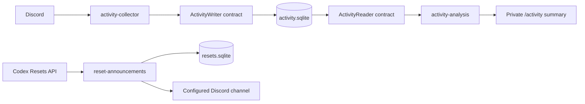

# Module architecture and independent work

The bot is a modular monolith: one Node.js process with independently owned features. Modules are not separate deployed services. They expose `BotModule` (`id`, `intents`, `commands`, `start`, `stop`), and only `src/app.ts` wires dependencies. A module must not import another feature's implementation, the application composition root, or a concrete shared storage adapter. Tests enforce these boundaries.

## Work ownership

| Independent task | Owned paths | Stable dependency | Validation |
| --- | --- | --- | --- |
| Reset feed and announcement delivery | `src/modules/reset-announcements/`, `tests/resets.test.ts` | `BotModule`, Discord client, injected logger | API pagination/errors, delivery retries, restart deduplication |
| Activity ingestion | `src/modules/activity-collector/`, collector tests | `ActivityWriter` | Human-message filtering, guild/channel exclusions, metadata mapping |
| Activity analysis and summaries | `src/modules/activity-analysis/`, analysis tests | `ActivityReader` | Unique member counts, time windows, UTC grouping, empty data |
| Persistence adapter | `src/storage/activity-store.ts`, storage tests | Both activity contracts | Deduplication, restart persistence, retention |
| Integration/platform | `src/app.ts`, `src/index.ts`, `src/config.ts`, command deployment, `src/core/` | Module public factories/contracts | Lifecycle and architecture tests, full check |

Activity tests currently share `tests/activity.test.ts`; split new tests into `tests/activity-collector.test.ts`, `tests/activity-analysis.test.ts`, or `tests/activity-store.test.ts` when assigning concurrent work to avoid edits to the same file. Each task can develop against an in-memory implementation of its contract. Changes to shared contracts should be agreed before implementation, with wiring handled by one integration task. Existing adapters may later be replaced with a database service without changing collector or analysis business logic.

## Contracts

`MessageActivity` v1 contains only message ID, guild ID, channel ID, user ID, and Unix timestamp in milliseconds. `ActivityWriter.record` is synchronous and idempotent by message ID; failures throw. `prune` removes events strictly before the cutoff. `ActivityReader.read` streams records for one guild in a half-open `[from, until)` window. Consumers must not mutate the database during iteration. `collectionStartedAt` is when this data store was initialized, not proof of continuous coverage.

Message statistics measure observed message creation, including messages later deleted. Edits do not add counts. Bots, webhooks, system messages, other servers, and excluded channels are filtered. Message content is never persisted or analyzed; REST history responses are reduced to activity metadata. Threads are counted as separate channels; excluding a parent channel excludes its threads. Manual reports backfill accessible message history. Voice activity is not tracked. Inaccessible channels and unavailable history cause gaps.

The analysis module aggregates records through the read contract; it has no ingestion listener or write access. `/activity days:7` returns an administrator-only, ephemeral statistical summary. The window is clamped to configured retention and the store's start time. Output includes totals, distinct members, ten busiest channels, and up to fourteen active UTC days. It does not interpret conversation content or use an LLM.

## Lifecycle and configuration

Modules declare gateway intents and commands before login. The host starts them after Discord is ready and stops them in reverse order before stores close. Feature startup failure unwinds previously started modules; starts must clean up any partial initialization before throwing. Module background errors are logged locally. Reset source outages retry without stopping activity collection.

`ACTIVITY_COLLECTOR_ENABLED` and `ACTIVITY_ANALYSIS_ENABLED` are independent. Existing data can be analyzed with collection off, or gathered with analysis off. Re-register slash commands when changing analysis enablement. The reset module is always registered; `/resets enable` activates its destination. Without a destination it does not fetch or post resets. Each module receives narrow constructor dependencies rather than a global service locator.

## Reset semantics and delivery

Uses the free public [API](https://codex-resets.com/api/docs) at `/api/v1/status` and paginated `/api/v1/resets`. It validates response schemas, applies 15-second request timeouts, and honors `Retry-After` on HTTP 429. The API is a third-party tracker. Forecast/watch probabilities are not posted. Scheduled entries are explicitly marked unconfirmed; a passed scheduled timestamp is never treated as completion. Regular and banked resets are labeled separately.

On first successful poll, historical resets are recorded silently and only the newest reset plus any pending scheduled reset are posted. Subsequent polls publish unseen reset events and changed scheduled times only when the rendered announcement has not already been recorded for that destination. Content fingerprints also suppress unchanged posts when upstream IDs or equivalent timestamp spellings change; legacy event receipts seed these fingerprints during polling. Delivery receipts are scoped to server and channel, persist across restarts, and are written only after successful Discord sends. Polls never overlap. Each post credits Codex Resets and links its original source when available.

Delivery is at least once: a process crash between Discord accepting a message and SQLite saving the receipt can cause a duplicate on recovery. A stable enforced Discord nonce reduces this risk for recent retries but does not guarantee exactly-once delivery. Keep `DATA_DIR` persistent, run one bot process, and do not delete receipt storage unless intentionally resetting the feed. The initial implementation reads all API history on each poll (five minutes by default), following pagination; it caps at 100 pages and rejects partial snapshots.

## Storage and operations

Separate SQLite databases isolate reset delivery state from activity data. Activity stores a unique row per observed human message and prunes on startup and hourly (90 days by default). SQLite WAL mode supports crash recovery. Stop the bot before copying database files for backup, or use SQLite's backup facilities. Mount `DATA_DIR` on persistent storage when deploying.

Node 22.13+ is required for built-in SQLite without an extra flag. Node 22 may display its experimental SQLite warning. The implementation targets a single running instance. Scaling ingestion/analysis into separate processes requires an explicit queue/database and coverage design; module boundaries make that change possible but do not provide distributed coordination today.

## Weekly activity delivery

Run `/activity-summary enable` and keep analysis enabled to post every Sunday at 12:00 noon in `Europe/Warsaw`. The analysis module owns scheduling and formatting, receives a publisher and receipt-store interface, and uses its existing read-only activity contract. It does not depend on the reset module or collector. `src/storage/summary-delivery-store.ts` supplies the SQLite receipt adapter; `src/app.ts` supplies the Discord publisher. The schedule is checked immediately on startup and every minute, with no overlapping executions.

Each report covers the preceding Sunday noon through the current Sunday noon. Local calendar boundaries preserve noon during DST changes (transition weeks contain 167 or 169 hours). Reports show the actual available range when collection or retention covers less than a full week. Channel/day metrics match `/activity`; day buckets remain UTC. The configured destination's members can read posted summaries, so choose a channel appropriate for server-wide statistics. The bot needs View Channel and Send Messages there.

`summaries.sqlite` records the first enablement time and successful deliveries separately for each server/channel. First enablement waits for the next due Sunday; restarts retry the latest missed due summary without flooding older periods. Failed sends retry after one minute. As with reset posts, a crash between Discord accepting a message and persisting its receipt can cause a duplicate; stable Discord nonces reduce the recent-retry risk. Keep the data directory persistent and run one bot instance. Disabling the destination stops scheduled delivery without disabling the command. Enabling again or changing destinations keeps delivery history but waits for the next due Sunday. Repeating enable for the current destination preserves its original enablement time.

## Dynamic destinations

Administrator-only `/resets` and `/activity-summary` commands support `enable`, `disable`, and `status`. Enable defaults to the current channel and accepts a text or announcement channel option. Settings are scoped by guild and module in `settings.sqlite`, behind the `DestinationStore` contract. Each module receives its own `DestinationController`; it serializes settings changes with delivery so an old destination cannot receive a new send after a change is confirmed. Commands validate server ownership and bot permissions. Destinations start disabled and survive restarts; environment channel IDs are no longer used.

## On-demand history collection

The analysis command depends on the `ActivityRefresher` contract, injected by the composition root. The collector owns Discord history discovery and paging (`discord-history.ts`) and the independent refresh algorithm (`history.ts`). SQLite stores verified time intervals per guild/channel alongside activity rows. Gateway messages do not imply surrounding history is complete. Page writes precede coverage updates; failures leave unverified intervals eligible for retry. Boundary milliseconds are conservatively re-read so Discord snowflake pagination cannot skip messages sharing a timestamp. Pruning clips scan coverage alongside retained events.

Manual reports await refresh before querying the reader and retain the full requested window instead of clipping to gateway startup. The refresh is serialized, aborts during shutdown, and has an eight-minute deadline, leaving time to edit the deferred interaction. Errors produce explicit partial-coverage reports. Scheduled reports keep using stored data. No message content is persisted.
